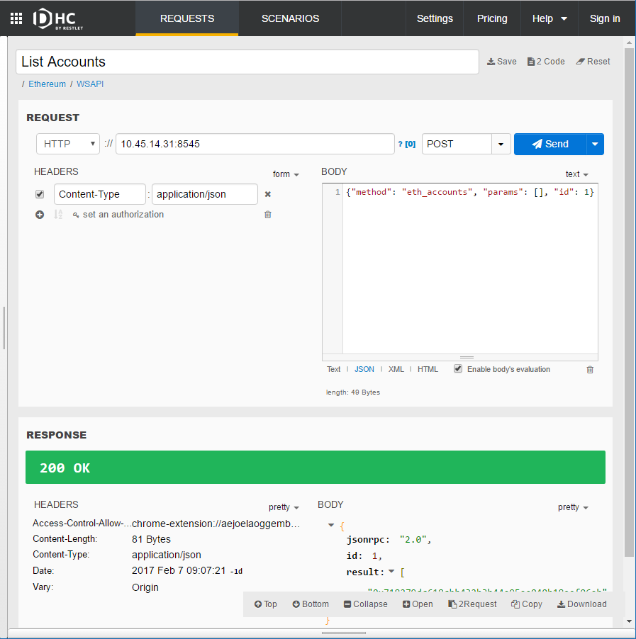
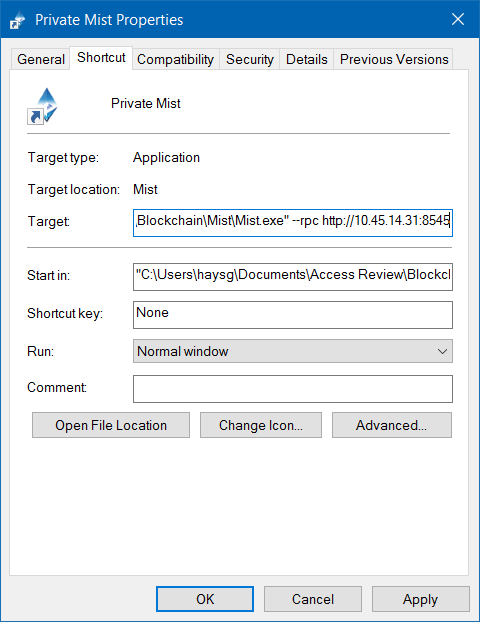
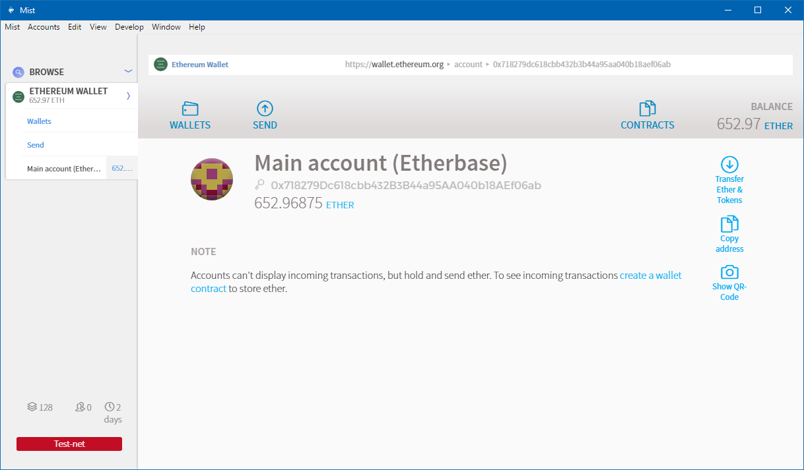

# Blockchain Transactions
The purpose of this project is to demonstrate the ability to record identity-related transactions on a private blockchain. An initial idea was to record actions or events associated with entitlements. However, a more pertinent scenario is to record an identity governance review on the blockchain.

The [Ethereum Project](https://www.ethereum.org/) seems like a good place to start since it supports so called "`smart contracts`" and was designed for uses other than pure digital cash transactions such as Bitcoin. I chose the Golang implementation, [go-ethereum](https://github.com/ethereum/go-ethereum).

## Ethereum Quick Start
See the wiki pages for this repostitory for more detail: [wiki pages](/wiki/Home).

Quick bash script to start go-ethereum. The default ports are fine.

RPC Port: default: 8545<br/>
Port default: 30303

```bash
# geth.sh
# Fetch local IP address into a variable.
MY_IP=$(ip addr list enp0s25 | grep "inet " | cut -d' ' -f6 | cut -d/ -f1)

# --testnet and --dev are mutually exclusive
~/src/ethereum/go-ethereum/build/bin/geth \
  --testnet --identity "IGBlock" \
  --rpc --rpcaddr "$MY_IP" --rpccorsdomain "*" \
  --nodiscover --rpcapi "db,eth,net,web3" console
```

This creates a blockchain on the Ethereum `TEST-NET`. It is possible to create a private blockchain as well using the `--networkid 1999` switch. See [Setting up a local private testnet](https://github.com/ethereum/homestead-guide/blob/master/source/network/test-networks.rst#geth-go-client-1) for more detail.

### REST Client
Since go-ethereum supports a JSON-RPC interface, I use the Chrome DHC extension (similar to Postman) as a RESTful client.



### Mist
Ethereum also supports a rich, native client based on [Meteor](https://www.meteor.com/) called [Mist](https://github.com/ethereum/mist). You may recognize Meteor as the Rocket.Chat native application is based on it as well.

To get Mist to connect to your private blockchain, use the `--rpc` command line switch, e.g.

```bat
Mist.exe --rpc http://10.45.14.31:8545
```

Windows users may set up a shortcut for the `Mist` application.



Here you can see the blockchain and the `Ether` that has been "mined" so far.


